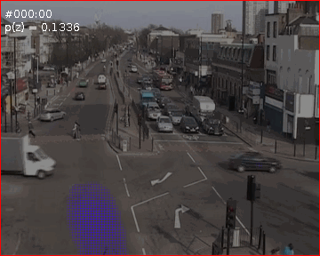
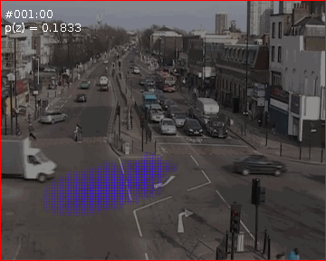

# PLSM
Derivation of the PLSM model, a time-sensitive evolution of Probabilistic Latent Semantic Analysis: [Probabilstic latent sequential motifs](https://pdfs.semanticscholar.org/994c/8fbd9cb8d51356ed22ca93bbfbfb82e36f68.pdf)


 



## Inference with pyro:

Example: 

`python -m pyro_plsm_inference --n-steps 400`


```
    parser.add_argument(
        '--documents-number',
        type=int,
        default=1,
        help='Number of documents')

    parser.add_argument(
        '--relative-time-length',
        type=int,
        default=20,
        help='Length of the motifs'
    )

    parser.add_argument(
        '--words-number',
        type=int,
        default=100,
        help='number of words')

    parser.add_argument(
        '--documents-length',
        type=int,
        default=3602,
        help='Length of documents')

    parser.add_argument(
        '--latent-motifs-number',
        type=int,
        default=5,
        help='Assumed number of latent motifs')

    parser.add_argument(
        '--n-steps',
        type=int,
        default=400,
        help=
        'number of steps for inference'
    )

    parser.add_argument(
        '--n-samples',
        type=int,
        default=10,
        help=
        'number of samples to use for inference'
    )

    parser.add_argument(
        '--lr',
        type=float,
        default=0.1,
        help='learning rate of the optimizer')

    parser.add_argument(
        '--observations-file-path',
        type=str,
        default='./data/real_data/vocabulary-set-b/Junction1/Junction1-b-s-m-plsa.tdoc',
        help=
        'path to the .tdoc observations file'
    )

    parser.add_argument(
        '--work-dir',
        type=str,
        default='./data/inference',
        help=
        'path to the working dir where results are stored'
    )

    parser.add_argument(
        '--seed', type=int, default=101, help='seed of random generator')

    parser.add_argument(
        '--plot-results', action='store_true', help='plot motifs and their starting times')
```

## Draw motifs on image with bundle script:

[Bundle script tool](https://dl.heeere.com/preacademic-bundle-2013-07-16-17_24_06.tgz)

A template is provided in motifs_gifs_bundle_script.sh

```
junction1_path=$(pwd)/data/real_data/vocabulary-set-b/Junction1
run_bundle=$(pwd)/academic-bundle-2013-07-16-17_24_06/pre-built-release/run-main
junction1_bg=$junction1_path/Junction1.png
juntion1_pwz=$junction1_path/Junction1-b-s-m.tdoc_100.Pwz
results=$(pwd)/data/inference/results
junction1_map=$junction1_path/Junction1.map

$run_bundle motif-images ./data/gifs/0/junction $junction1_bg $juntion1_pwz $results $junction1_map --simple --rg -m -scale 1
```