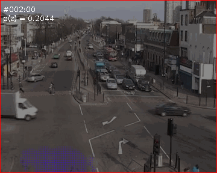

# PLSM
Derivation of the PLSM model, a time-sensitive evolution of Probabilistic Latent Semantic Analysis: [Probabilstic latent sequential motifs](https://pdfs.semanticscholar.org/994c/8fbd9cb8d51356ed22ca93bbfbfb82e36f68.pdf)


 




## Inference with pyro:

Example: 

`python -m pyro_plsm_inference --n-steps 400`


## Draw motifs on image with bundle script:

[Bundle script tool](https://dl.heeere.com/preacademic-bundle-2013-07-16-17_24_06.tgz)

A template is provided in motifs_gifs_bundle_script.sh

```
junction1_path=$(pwd)/data/real_data/vocabulary-set-b/Junction1
run_bundle=$(pwd)/academic-bundle-2013-07-16-17_24_06/pre-built-release/run-main
junction1_bg=$junction1_path/Junction1.png
juntion1_pwz=$junction1_path/Junction1-b-s-m.tdoc_100.Pwz
results=$(pwd)/data/inference/results
junction1_map=$junction1_path/Junction1.map

$run_bundle motif-images ./data/gifs/0/junction $junction1_bg $juntion1_pwz $results $junction1_map --simple --rg -m -scale 1
```